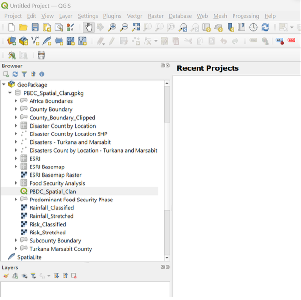

# Spatial Clan: Pale Blue Dot submission documentation

This documents the creation of Spatial Clan's submission to the Pale Blue Dot: Visualization Challenge.

# Pre-Guide Instructions: Downloading QGIS Software and Accessing Geopackage Data

### Requirements:
QGIS: Ensure you have QGIS installed on your computer. You can download the latest version from the official QGIS website.

### Instructions:

1. Download the GeoPackage: Make sure you have downloaded the GeoPackage file containing our datasets and processed features.
2. Launch QGIS: Open QGIS on your computer.
3. Navigate to GeoPackage: In the Browser Panel, navigate to “GeoPackage”
4. Add GeoPackage: Right-click “GeoPackage” and select “New Connection” Navigate your file explorer and select the GeoPackage file (PBDC_Spatial_Clan.gpkg) to add it to the QGIS Browser Panel.
5. Access Datasets and Processed Features: Once the GeoPackage is added to the Browser Panel, you can expand it to view the datasets and processed features stored within.
6. Open QGIS Project: To open the QGIS project file that lies within the GeoPackage, navigate to PBDC_Spatial_Clan and double-click the file to load the project.
7. Review Project: Once the project is loaded, you should see the datasets and processed features on the
map canvas.

<em>Figure 1: GeoPackage in QGIS</em>

