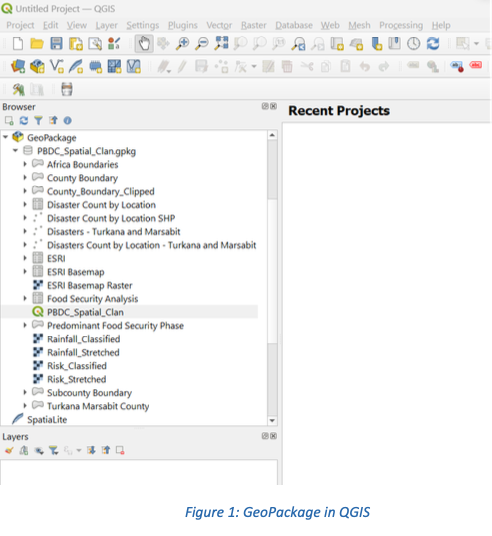
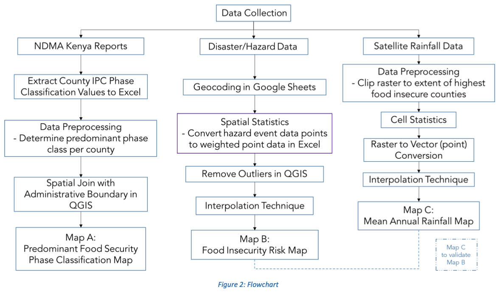
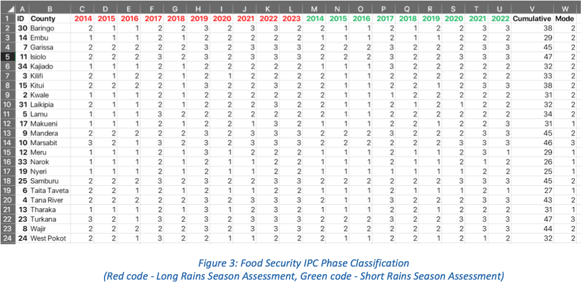
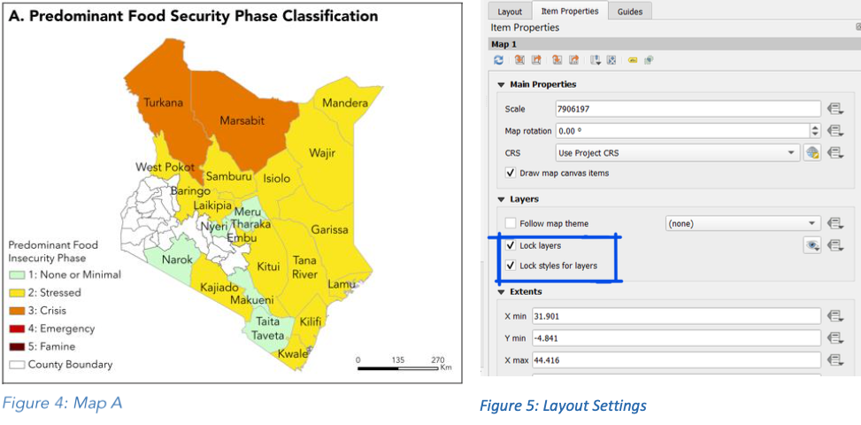
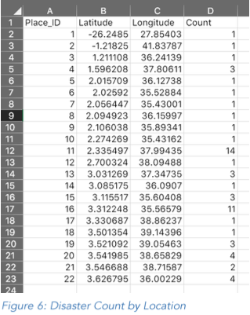
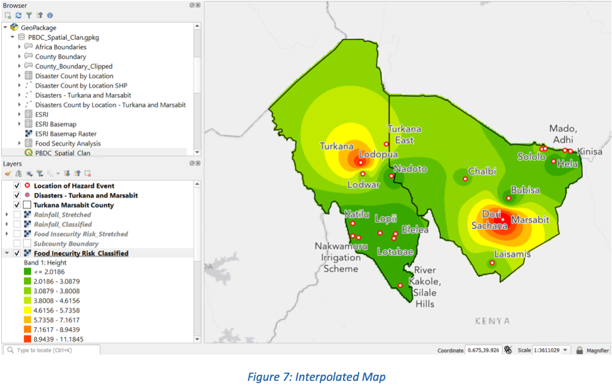
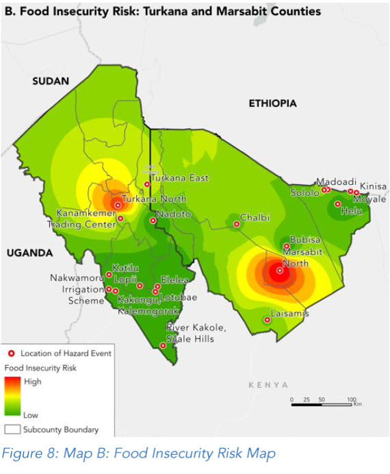
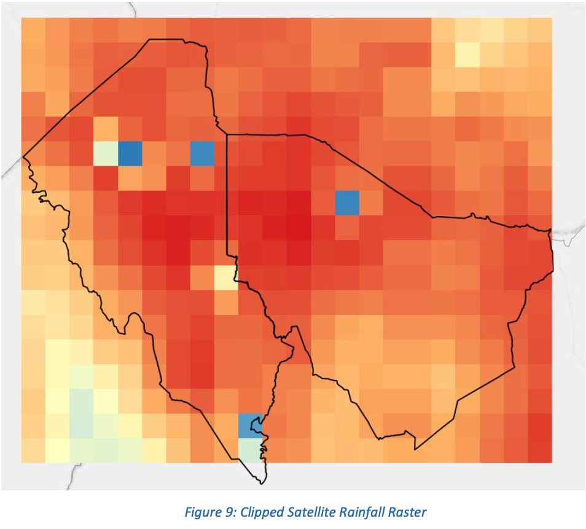
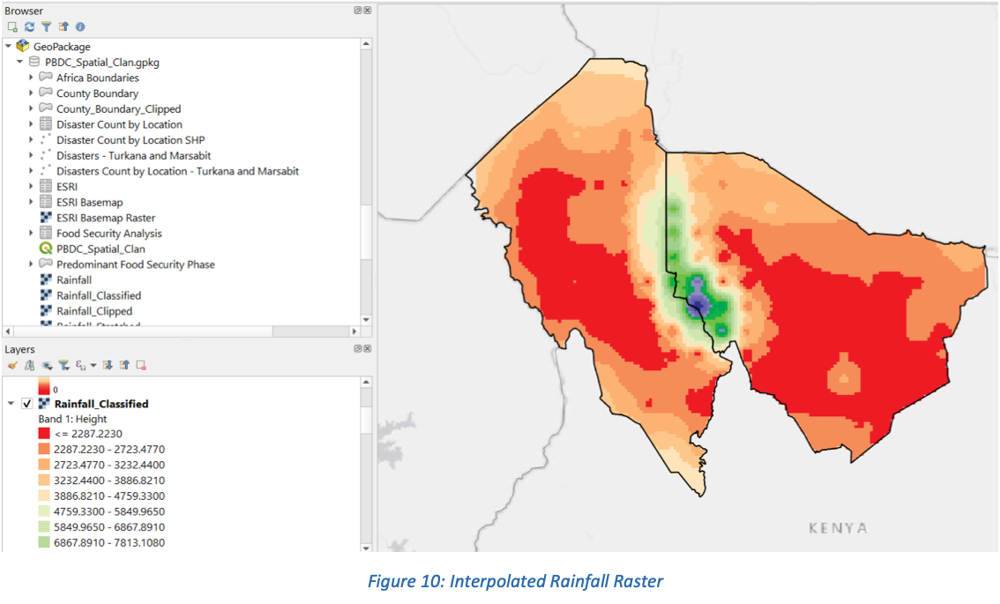

# Spatial Clan: Pale Blue Dot submission documentation

This documents the creation of Spatial Clan's submission to the Pale Blue Dot: Visualization Challenge.

# Pre-Guide Instructions: Downloading QGIS Software and Accessing Geopackage Data

### Requirements:

QGIS: Ensure you have QGIS installed on your computer. You can download the latest version from the official QGIS website.

### Instructions:

1. Download the GeoPackage: Make sure you have downloaded the GeoPackage file containing our datasets and processed features.
2. Launch QGIS: Open QGIS on your computer.
3. Navigate to GeoPackage: In the Browser Panel, navigate to “GeoPackage”
4. Add GeoPackage: Right-click “GeoPackage” and select “New Connection” Navigate your file explorer and select the GeoPackage file (PBDC_Spatial_Clan.gpkg) to add it to the QGIS Browser Panel.
5. Access Datasets and Processed Features: Once the GeoPackage is added to the Browser Panel, you can expand it to view the datasets and processed features stored within.
6. Open QGIS Project: To open the QGIS project file that lies within the GeoPackage, navigate to PBDC_Spatial_Clan and double-click the file to load the project.
7. Review Project: Once the project is loaded, you should see the datasets and processed features on the
map canvas.

# Visualization Guide

## 1. Map A: Predominant Food Security Phase Classification Map

### 1.1 Extract County IPC Phase Classification Values to Excel

Food and nutrition security assessment reports are conducted for both the long rains and short rains seasons across Kenya by the Kenya Food Security Steering Group. These comprehensive reports are made publicly accessible through the National Drought Management Authority (NDMA) knowledge database. Upon accessing these reports (2014 – 2023), data regarding the Food Security IPC Phase classification assigned to each specific county during the respective Long Rains or Short Rains seasons is extracted into an Excel sheet, organizing each IPC Class according to the assessed administrative units in Kenya.

### 1.2 Data Preprocessing – Determine predominant phase class per county

To determine the predominant IPC phase for each county, the mode IPC class was calculated.

### 1.3 Spatial Join with Administrative Boundary in QGIS

In QGIS, the administrative shapefile of Kenya's counties and the food security data in CSV format were imported. To merge these datasets spatially, the 'Join Attributes by Field Value' function was used. The objective was to connect both files using the 'County' column, facilitating the visualization of the predominant food security IPC phase class for each county on the map.

### 1.4 Visualization

Following the spatial join, the symbology for the resulting layer was set to 'Categorized'. Subsequently, the category labels and color codes were customized to accurately represent the IPC classes. These adjustments were made by accessing the layer properties through a series of steps: right-clicking the joined layer, selecting 'Properties,' and navigating to the 'Symbology' tab. Additionally, to display the county labels, the same process was followed: right-clicking the joined layer, selecting 'Properties,' then navigating to 'Labels,' and choosing the 'County' column. Further refinements, such as adjusting label placements and font styles, were made as needed. Once these settings were optimized, the map frame was incorporated into the layout for additional styling adjustments. The layers and layer styles were locked before proceeding to develop Map B.

## 2. Map B: Food Insecurity Risk Map: Turkana and Marsabit Counties

### 2.1 Geocoding in Google Sheets

The disaster dataset for Kenya was sourced from the [Humanitarian Data Exchange](https://data.humdata.org/dataset/kenya-natural-disaster-inventory-mapped-by-event-type-1999-2013/resource/2ebef02a-72a0-4816-87b8-f295ad1f0fab?view_id=3d2467f6-5fd7-401d-8de6-8e785b8c33d9). Although the Excel file contained columns denoting longitude (X) and latitude (Y), we utilized a geocoding process to validate the listed locations. This involved implementing a [script developed by Will Geary](https://willgeary.github.io/data/2016/11/04/Geocoding-with-Google-Sheets.html) on Google Sheets.

### 2.2 Spatial Statistics

Upon observing multiple disasters occurring in the same location, we recognized the need to create a weighted point dataset that accurately reflected the density of occurrences at each specific location. To achieve this, we utilized the PivotTables tool in Excel, resulting in a tabulated count of disasters by location, as illustrated.

### 2.3 Remove Outliers in QGIS

From Map A, we identified Turkana and Marsabit counties to be in the highest IPC Phase Class, designated as Class 3: Crisis stage. To isolate these counties, we employed the 'Select by Attributes' function in QGIS, enabling us to clip our county administrative boundaries shapefile to Turkana and Marsabit counties and export them as a new shapefile for display.

Utilizing the 'Create points layer from table' tool, we imported both the count-by-location file and the initial disaster events file as point shapefiles. Outliers were removed by clipping both shapefiles to the Turkana and Marsabit county administrative file using the 'Clip' function.

### 2.4 Interpolation Technique

The interpolation method applied was the Inverse Distance Weighting Technique, which was used to interpolate the surface of Turkana and Marsabit counties based on the count of disasters per location. Parameters for the pixel spatial resolution of the interpolated layer were configured as desired within the 'IDW Interpolation' tool.

To adjust the symbology, we accessed the interpolation layer's properties by right-clicking it and selecting "Properties," then navigated to the "Symbology" tab. We opted for single-band pseudo- color band rendering, set interpolation to 'Discrete', and chose the Cubic method for resampling to enhance visual clarity. Color codes for the discrete classes were also customized.

The initial clipped disaster file was overlaid, and labeling properties were configured by right- clicking the clipped disaster shapefile, selecting "Properties," and then navigating to "Labels." Label styling and placement were adjusted as needed. To provide a basemap for the map frame, ESRI's Basemap was obtained from the QuickMapServices plugin and integrated accordingly.

The map frame was then added to our layout and the layers and layer styles were locked before proceeding to develop Map C.

### 2.5 Visualization

The legend for Map B underwent adjustments to improve its visual clarity. A copy of the interpolated layer was created, and its interpolation type was set to Linear to obtain the desired color ramp. A legend was then generated from this layer, and then edited using Inkscape, an open source graphics program, to retain only the color ramp. This customized color ramp was imported as an image and incorporated into the legend, providing a clear representation of the data, as demonstrated.

## Map C: Mean Annual Rainfall Map

### 3.1 Data Preprocessing

The satellite rainfall dataset (2014 – 2024) was obtained from [NASA’s Giovanni website](https://giovanni.gsfc.nasa.gov/giovanni/) in the NetCDF format. This raster dataset was first projected to the WGS84 Coordinate system by using the ‘Warp (reproject)’ function and later clipped to the Turkana and Marsabit administrative boundary shapefiles.

### 3.2 Cell Statistics

After the initial preprocessing steps, the Cell Statistics algorithm (Toolbox > Raster Analysis > Cell Statistics) was applied to compute the value for each cell within the clipped raster dataset. Utilizing the SUM function, this process aggregated the rainfall data across the region of interest, generating a comprehensive overview of the mean annual rainfall distribution.

### 3.3 Raster to Vector (point) Conversion

To further refine our analysis, the raster pixels were converted into point features (Toolbox > Raster Creation > Raster Pixels to Points). This conversion facilitated a more granular representation of the rainfall data, enabling us to interpolate the annual rainfall distribution with increased accuracy and precision.

### 3.4 Interpolation Technique

The Inverse Distance Weighting (IDW) interpolation technique was employed to generate a continuous surface representing the mean annual rainfall across Turkana and Marsabit counties. By leveraging the spatial relationship between data points, IDW interpolation provided a reliable method for estimating rainfall values at unsampled locations within the study area.

The layer properties of the interpolated layer were edited and adjusted to match those applied in the creation of the interpolated disaster map detailed in section 2. Unique color codes were then selected to enhance the visual representation of the data on this map according to specific preferences.

### 3.5 Visualization

Similar to the process detailed in section 2.4 for Map B, this approach was taken for Map C.

## 4. Layout

Additional elements added to the layout other than the standard map elements included the disaster icons that were used to show the percentage occurrence of disasters in Turkana and Marsabit counties. These humanitarian icons were obtained from [UN OCHA’s icon vocabulary](https://brand.unocha.org/d/xEPytAUjC3sH/icons?_gl=1*j7iasm*_ga*NTMzMjI1NjkyLjE3MDg3MTMwMDA.*_ga_E60ZNX2F68*MTcxMDkzNjM1NS4zLjAuMTcxMDkzNjM1NS42MC4wLjA.#/-/humanitarian-icons).