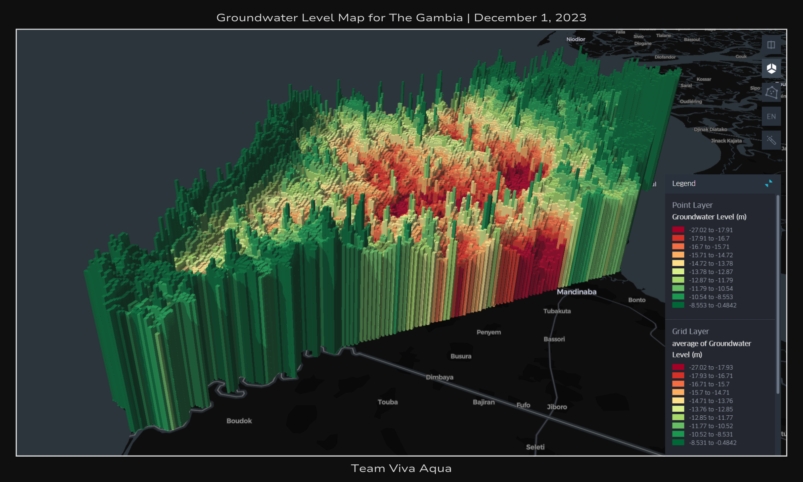

# AquaViva
[![Contributors][contributors-shield]][contributors-url]
[![Forks][forks-shield]][forks-url]
[![Stargazers][stars-shield]][stars-url]
[![Issues][issues-shield]][issues-url]
[![MIT License][license-shield]][license-url]

<!-- PROJECT LOGO -->

  

   
  
  
   

<!-- TABLE OF CONTENTS -->

  
<b>Table of Contents</b>

  <ol>
    <li><a href="#about">About</a></li>
    <li>
      <a href="#data">Data</a>
      <ul>
        <li><a href="#data-sources">Data Sources</a></li>
        <li><a href="#features">Features</a></li>
        <li><a href="#output">Output</a></li>
      </ul>
    </li>
    <li><a href="#machine-learning">Machine Learning</a></li>
    <li><a href="#visualization">Visualization</a></li>
    <li><a href="#future-work">Future Work</a></li>
    <li><a href="#contributing">Contributing</a></li>
    <li><a href="#built-with">Built With</a></li>
    <li><a href="#license">License</a></li>
    <li><a href="#contact">Contact</a></li>
    <li><a href="#acknowledgements">Acknowledgements</a></li>
    <li><a href="#references">References</a></li>
  </ol>

<!-- ABOUT-->
# About
AquaViva is an innovative project aimed at addressing one of the most important sustainable development goals and overall global humanitarian challenges of our time - the lack of access to clean water (SDG 6). To accomplish this, we are using cutting-edge machine learning models, trained on various datasets including satellite imagery, climatic variables, and geological features, to produce near real-time, high resolution maps of groundwater level.

We believe that this tool has great potential to help communities mitigate water scarcity, monitor groundwater, and efficiently identify suitable sources of clean water. As such, we are committed to keeping our project open-source and free-to-use, and we welcome any contributors to build off of what we have done. This project is part of [NASA's Pale Blue Dot Visualization Challenge](https://www.drivendata.org/competitions/256/pale-blue-dot/), which shares our deep commitment to using technology for environmental and social good. As per challenge guidelines, all datasets and tools used were 100% open-source.

**Created by Team Viva Aqua** | **Francisco Furey, Adam Zheng, Malena Vildoza, El Hadji Malick DIEYE (AKA Jay) 😊**

(<a href="#readme-top">back to top</a>)

# Data
For our training data, we conducted an extensive literature review into past studies, as well as key concepts such as the water balance equation, in order to determine the variables that would provide a comprehensive set of information for predicting groundwater level. We then collected, cleaned, preprocessed, and integrated the datasets together using Python scripts (see [scripts/preprocessing](https://github.com/franfurey/aquaViva/tree/master/scripts/preprocessing)) and Jupyter Notebooks (see [notebooks/preprocessing](https://github.com/franfurey/aquaViva/tree/master/notebooks/preprocessing))

1. **Data Collection:** First and foremost, we used IGRAC/GGIS to obtain piezometric (groundwater level) data from 2015-2022 for 36 wells distributed across Gambia. Then we gathered corresponding data for our 13 input variables (see <a href="#features">Features</a>), sourced from Aﾏﾏ・EARS, ClimateSERV, BGS, and GGIS (see <a href="#data-sources">Data Sources</a>). Most of the raw data is available under [data/original_data](https://github.com/franfurey/aquaViva/tree/master/data/original_data) (except for a few files that were too large to upload) 
2. **Data Cleaning and Preprocessing:** We used Jupyter notebooks (see [notebooks/preprocessing](https://github.com/franfurey/aquaViva/tree/master/notebooks/preprocessing)) to manage the various data formats (.nc4, .nc, .csv), visualize/analyze the raw data, and account for missing/erroneous data using nearest neighbor algorithms and linear interpolation. QGIS was also used to process hydrogeological region and topographical data. All processed data is available under [data/processed_data](https://github.com/franfurey/aquaViva/tree/master/data/processed_data)
3. **Data Integration:** Using pandas & geopandas, we merged datasets based on date, latitude, and longitude to form our primary dataset, which consisted of ~6600 rows (see [data/processed_data/wells_data_gambia_for_machine_learning.csv](https://github.com/franfurey/aquaViva/blob/master/data/processed_data/wells_data_gambia_for_machine_learning.csv))

### Data Sources

* **[Global Groundwater Information System](https://ggis.un-igrac.org/) (GGIS)**: An interactive portal by [IGRAC](https://www.un-igrac.org/) that compiles data on global groundwater resources. We use it to access groundwater level data as well as data on hydrogeological regions.

* **[British Geological Survey](https://www2.bgs.ac.uk/groundwater/international/africanGroundwater/maps.html) (BGS)**: This research project by BGS focused on the resilience of African groundwater to climate change. We incorporate their depth to groundwater data, which classifies data into 6 categories (0-7, 7-25, 25-50, 50-100, 100-250, >250 meters) - significantly lower resolution & precision than our targets, but still potentially useful.

* **[Application for Extracting and Exploring Analysis Ready Samples](https://appeears.earthdatacloud.nasa.gov/api/?python#introduction) (Aﾏﾏ・EARS)**: We used this tool to extract various parameters such as NDVI, MIR, EVI, Elevation, Curvature, Drainage Density, and Slope.

* **[ClimateSERV](https://climateserv.servirglobal.net/help)**: A tool by SERVIR, NASA, & USAID that provides climatic and vegetation data. We wrote a custom Python library ([climateservAccess](https://pypi.org/project/climateservaccess/)) for accessing the ClimateSERV API and used it to gather soil moisture, evapotranspiration, streamflow, and precipitation data. 

### Features
| Datatype                                      | Description                                      | Data Source                                 | Resolution       |
|-----------------------------------------------|--------------------------------------------------|---------------------------------------------|------------------|
| LIS_Soil_Moisture_Combined                     | Soil Moisture                                   | ClimateSERV/LIS                              | 3 km            |
| LIS_Streamflow                                 | Streamflow                                      | ClimateSERV/LIS                              | 3 km            |
| LIS_ET                                         | Evapotranspiration                              | ClimateSERV/LIS                              | 3 km            |
| MOD13Q1_061__250m_16_days_EVI                  | Enhanced Vegetation Index (EVI)                 | Aﾏﾏ・EARS/MODIS                               | 250 m           |
| MOD13Q1_061__250m_16_days_MIR_reflectance      | Mid-Infrared Reflectance                        | Aﾏﾏ・EARS/MODIS                               | 250 m           |
| MOD13Q1_061__250m_16_days_NDVI                 | Normalized Difference Vegetation Index (NDVI)   | Aﾏﾏ・EARS/MODIS                               | 250 m           |
| NASA_IMERG_Late                                | Precipitation                                   | ClimateSERV/IMERG                            | 10 km           |
| DepthToGroundwater                             | Estimated Groundwater Level Range               | BGS                                          | 5 km            |
| Curvatu_tif2                                   | Curvature                                       | Aﾏﾏ・EARS/NASADEM                             | 30 m            |
| Drainage_density                               | Drainage Density                                | Aﾏﾏ・EARS/NASADEM                             | 30 m            |
| Slope_tif2                                     | Slope                                           | Aﾏﾏ・EARS/NASADEM                             | 30 m            |
| Hydrogeo                                       | Hydrogeological Region                          | IGRAC/GGIS                                   | N/A             |
| NASADEM_HGT                                    | Elevation                                       | Aﾏﾏ・EARS/NASADEM                             | 30 m            |

### Output
| Datatype                                      | Description                                      | Data Source                                 |
|-----------------------------------------------|--------------------------------------------------|---------------------------------------------|
| GROUNDWATER_LEVEL                             | Groundwater Level                                | IGRAC/GGIS                                  |

(<a href="#readme-top">back to top</a>)

# Machine Learning
All relevant Jupyter Notebooks are located in [notebooks/machine_learning](https://github.com/franfurey/aquaViva/tree/master/notebooks/machine_learning). 

4. **Model Selection and Training:** First, we divided our dataset based on well IDs to avoid overfitting, allocating 83% for training and 17% for testing. We trained 6 different regression models using [scikit-learn](https://scikit-learn.org/stable/):  [SVR](https://scikit-learn.org/stable/modules/generated/sklearn.svm.SVR.html), [AdaBoostRegressor](https://scikit-learn.org/stable/modules/generated/sklearn.ensemble.AdaBoostRegressor.html), [GradientBoostingRegressor](https://scikit-learn.org/stable/modules/generated/sklearn.ensemble.GradientBoostingRegressor.html), [RandomForestRegressor](https://scikit-learn.org/stable/modules/generated/sklearn.ensemble.RandomForestRegressor.html), [SGDRegressor](https://scikit-learn.org/stable/modules/generated/sklearn.linear_model.SGDRegressor.html), and [LinearSVR](https://scikit-learn.org/stable/modules/generated/sklearn.svm.LinearSVR.html). Our computational resources limited our ability to test more computationally intensive models like neural networks. However, with access to more powerful machines, exploring these models could yield even more promising results.
5. **Model Evaluation:** We employed metrics like [Mean Squared Error (MSE)](https://scikit-learn.org/stable/modules/generated/sklearn.metrics.mean_squared_error.html), [Mean Absolute Error (MAE)](https://scikit-learn.org/stable/modules/generated/sklearn.metrics.mean_absolute_error.html), and [Coefficient of Determination (R²)](https://scikit-learn.org/stable/modules/generated/sklearn.metrics.r2_score.html) for performance assessment, achieving our best result (MAE = 2.6 m, R² = 0.42) with **Linear SVR**.
6. **Model Optimization:** We also applied [Cross-Validation](https://scikit-learn.org/stable/modules/cross_validation.html) and [GridSearchCV](https://scikit-learn.org/stable/modules/generated/sklearn.model_selection.GridSearchCV.html) for hyperparameter tuning to optimize the model's performance, and combined [LinearSVR](https://scikit-learn.org/stable/modules/generated/sklearn.svm.LinearSVR.html) with [Nystroem](https://scikit-learn.org/stable/modules/generated/sklearn.kernel_approximation.Nystroem.html) for kernel optimization.

(<a href="#readme-top">back to top</a>)

# Visualization

7. **Visualization Data:** We first defined an area of interest within QGIS, and then split it up into ~2874 points, each representing a 500m pixel. We then gathered feature data for each of these points (see [data/final_dataset](https://github.com/franfurey/aquaViva/tree/master/data/final_dataset)), processed and compiled it as before (see [notebooks/gambia_dataset](https://github.com/franfurey/aquaViva/tree/master/notebooks/gambia_dataset)), and ran it through the Linear SVR model (see [notebooks/gambia_dataset/LinearSVR_final_dataset.ipynb](https://github.com/franfurey/aquaViva/blob/master/notebooks/gambia_dataset/LinearSVR_final_dataset.ipynb)) to get predicted groundwater levels. Note: we only used 500m resolution due to time constraints, higher resolutions would have otherwise been entirely feasible. 
8. **Visualization Creation:** Once we had ML model results, we used IDW (Inverse Distance Weighting) interpolation in QGIS to increase the resolution to about 177m, and exported data to a csv. Then we uploaded the csv to [kepler.gl](https://kepler.gl/) and put together our interactive visualization, exported it to an html file, and customized it to create our Aqua Viva website.

(<a href="#readme-top">back to top</a>)

<!-- FUTURE WORK -->
# Future Work

Given the enormous potential scale of this project, and the fact that we were just 4 people who worked on this for about a month, there is much else that remains to be done:
* **Model verification.** Although our model was trained on the best open-source data we could find, it was still limited (6600 data points across 36 wells). Despite our best efforts and what we believe to be reasonably accurate results, groundwater level is still a very complex variable to predict and this project would benefit greatly from more data to verify/improve our model.
* **Streamline model usage.** This was just a rough first pass for the process of getting feature data, running it through our model, and visualizing the results. So an important next step would be to create some sort of tool (perhaps a single Jupyter notebook) that streamlines this process and allows the user to adjust parameters easily.  
* **Time series data.** Due to time constraints, we only visualized data for one day (December 1, 2023). Especially once model usage is streamlined, it will be much easier to visualize time series data, which would be very useful for evaluating changes in groundwater level over time.
* **Near real-time data.** It is entirely possible to create a tool that automatically retrieves near real-time data, runs it through our model, and outputs data for visualization. Such a tool could be used for groundwater monitoring.
* **Expand area of interest.** Again, due to time constraints, we narrowed our focus to a smaller (but still high-impact) region of Gambia. Of course, with more time, it would be relatively trivial to create a visualization for all of Gambia. We have no idea if the model can be extrapolated to other regions of the world, but we think it might potentially be successful in regions with a similar biome to Gambia. More work should be done to verify this.

(<a href="#readme-top">back to top</a>)

<!-- CONTRIBUTING -->
# Contributing

Whether you would like to help with any of the future work outlined above, add your own data/ML models, or have any other ideas/suggestions - all contributions are welcome and encouraged! Simply fork the repo and create a pull request. You can also open an issue with the tag "enhancement". Thanks in advance for your contributions, and feel free to <a href="#contact">contact us</a> with questions!

1. Fork the Project
2. Create your Feature Branch (`git checkout -b feature/AmazingFeature`)
3. Commit your Changes (`git commit -m 'Add some AmazingFeature'`)
4. Push to the Branch (`git push origin feature/AmazingFeature`)
5. Open a Pull Request

(<a href="#readme-top">back to top</a>)

## Built With
![Python][Python]
![scikit-learn][scikit-learn]
![TensorFlow][TensorFlow]
![Jupyter][Jupyter]
![HTML][HTML]
![CSS][CSS]
![JavaScript][JavaScript]

(<a href="#readme-top">back to top</a>)

<!-- LICENSE -->
## License

Distributed under the MIT License. See `LICENSE` for more information.

(<a href="#readme-top">back to top</a>)

<!-- CONTACT -->
## Contact

(<a href="#readme-top">back to top</a>)

<!-- ACKNOWLEDGEMENTS -->
## Acknowledgements
* Thank you to [TANGO](https://tango.gm/) (The Association of Non-Governmental Organizations in the Gambia) for their insights and for connecting us with community leaders in the Gambia
* Thank you to [Jun Yuan Zhang](https://geoweb.tamu.edu/people/profiles/students/zhangjunyuan.html) for his advice regarding groundwater level prediction

(<a href="#readme-top">back to top</a>)

<!-- REFERENCES -->
## References
* [A Machine Learning Approach to Predict Groundwater Levels in California Reveals Ecosystems at Risk](https://www.frontiersin.org/articles/10.3389/feart.2021.784499/full#h3)
* [Groundwater Prediction Using Machine-Learning Tools](https://www.mdpi.com/1999-4893/13/11/300)
* [Prediction of groundwater level fluctuations under climate change based on machine learning algorithms in the Mashhad aquifer, Iran](https://iwaponline.com/jwcc/article/14/3/1039/93926/Prediction-of-groundwater-level-fluctuations-under)
* [Global Groundwater Dependent Ecosystems](https://kklausmeyer.users.earthengine.app/view/global-gde)
* [Our World in Data SDG 6 Tracker](https://ourworldindata.org/sdgs/clean-water-sanitation)
* [CodePen Back Button](https://codepen.io/ender2821/pen/LpgYOB)
* [CodePen Info on Hover](https://codepen.io/ruppysuppy/pen/rNWdWNp)

(<a href="#readme-top">back to top</a>)

<!-- MARKDOWN LINKS & IMAGES -->
<!-- https://github.com/Ileriayo/markdown-badges -->
[contributors-shield]: https://img.shields.io/github/contributors/franfurey/aquaViva.svg?style=for-the-badge
[contributors-url]: https://github.com/franfurey/aquaViva/graphs/contributors
[forks-shield]: https://img.shields.io/github/forks/franfurey/aquaViva.svg?style=for-the-badge
[forks-url]: https://github.com/franfurey/aquaViva/network/members
[stars-shield]: https://img.shields.io/github/stars/franfurey/aquaViva.svg?style=for-the-badge
[stars-url]: https://github.com/franfurey/aquaViva/stargazers
[issues-shield]: https://img.shields.io/github/issues/franfurey/aquaViva.svg?style=for-the-badge
[issues-url]: https://github.com/franfurey/aquaViva/issues
[license-shield]: https://img.shields.io/github/license/franfurey/aquaViva.svg?style=for-the-badge
[license-url]: https://github.com/franfurey/aquaViva/blob/master/LICENSE.txt
[linkedin-shield]: https://img.shields.io/badge/-LinkedIn-black.svg?style=for-the-badge&logo=linkedin&colorB=555

[Python]: https://img.shields.io/badge/Python-FFD43B?style=for-the-badge&logo=python&logoColor=blue
[Jupyter]: https://img.shields.io/badge/Jupyter-F37626.svg?&style=for-the-badge&logo=Jupyter&logoColor=white
[TensorFlow]: https://img.shields.io/badge/TensorFlow-%23FF6F00.svg?style=for-the-badge&logo=TensorFlow&logoColor=white
[JavaScript]: https://img.shields.io/badge/JavaScript-323330?style=for-the-badge&logo=javascript&logoColor=F7DF1E
[HTML]: https://img.shields.io/badge/HTML5-E34F26?style=for-the-badge&logo=html5&logoColor=white
[CSS]: https://img.shields.io/badge/CSS3-1572B6?style=for-the-badge&logo=css3&logoColor=white
[scikit-learn]: https://img.shields.io/badge/scikit--learn-%23F7931E.svg?style=for-the-badge&logo=scikit-learn&logoColor=white
